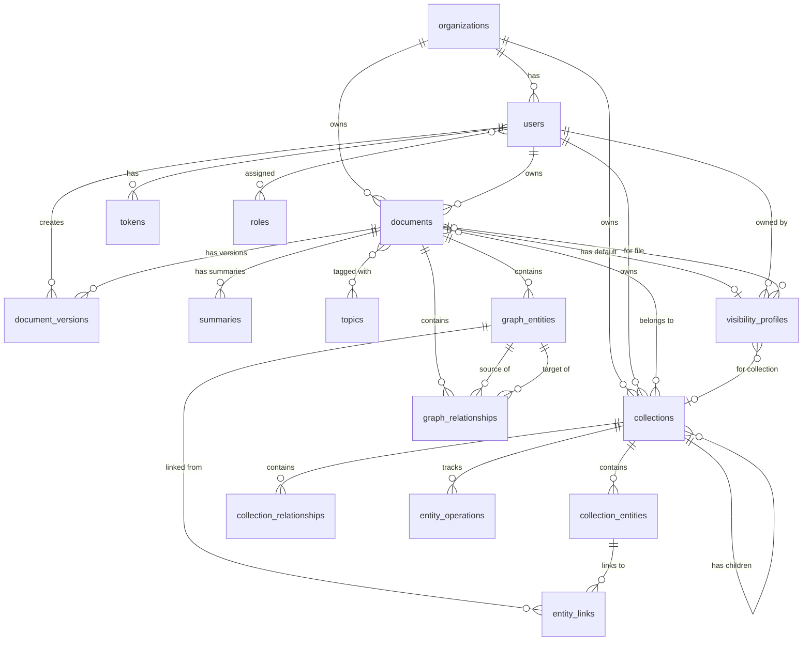

# Unified Database Schema Reference

**Package:** axai-pg
**Version:** 1.0
**Last Updated:** 2025-11-12
**Status:** Production

---

## Table of Contents

1. [Overview](#overview)
2. [Architecture](#architecture)
3. [Table Definitions](#table-definitions)
4. [Enum Types](#enum-types)
5. [Relationships](#relationships)
6. [Usage Examples](#usage-examples)
7. [Multi-Tenant Support](#multi-tenant-support)
8. [Migration Notes](#migration-notes)

---

## Overview

### Purpose

The axai-pg unified schema provides a single, comprehensive database structure used by multiple applications:
- **market-ui**: File management web application with graph visualization
- **job-queue**: Background job processing for document extraction and analysis

### Key Features

✅ **Multi-tenant Support** - Optional `org_id` on all major entities
✅ **File Management** - Complete document storage with versioning
✅ **Knowledge Graph** - Entity and relationship tracking across documents
✅ **Collections** - Document grouping with merged graph views
✅ **Authentication** - User management with role-based permissions
✅ **Audit Logging** - Comprehensive audit trail for all actions
✅ **Graph Visibility** - Configurable visibility profiles for graph visualization

### Database

- **Type**: PostgreSQL 17+
- **Extensions**: uuid-ossp
- **Total Tables**: 20 main tables + association tables
- **Schema**: public

---

## Architecture

### Services Using This Schema

| Service | Purpose | Primary Tables |
|---------|---------|----------------|
| **market-ui** | File management UI | documents, collections, visibility_profiles, graph_entities |
| **job-queue** | Document processing | documents, summaries, topics, graph_entities, graph_relationships |

### Schema Components

```
┌─────────────────────────────────────────────────────────────┐
│                    UNIFIED SCHEMA                            │
├─────────────────────────────────────────────────────────────┤
│                                                              │
│  ┌───────────────┐      ┌──────────────┐                   │
│  │  Users &      │      │  Documents   │                   │
│  │  Auth         │──────│  & Files     │                   │
│  └───────────────┘      └──────────────┘                   │
│        │                       │                             │
│        │                       ├─── Versions                │
│        │                       ├─── Summaries               │
│        │                       ├─── Topics                  │
│        │                       └─── Collections             │
│        │                                                     │
│        └─── Roles & Permissions                            │
│                                                              │
│  ┌───────────────────────────────────────────────────┐     │
│  │         Knowledge Graph                            │     │
│  ├───────────────────────────────────────────────────┤     │
│  │  • GraphEntity (entities from documents)           │     │
│  │  • GraphRelationship (connections)                 │     │
│  │  • CollectionEntity (merged views)                 │     │
│  │  • CollectionRelationship (merged connections)     │     │
│  │  • EntityLink (cross-file entity linking)          │     │
│  │  • VisibilityProfile (graph display config)        │     │
│  └───────────────────────────────────────────────────┘     │
│                                                              │
└─────────────────────────────────────────────────────────────┘
```

---

## Table Definitions

### Core Tables

#### 1. users

User accounts for authentication and ownership.

| Column | Type | Constraints | Description |
|--------|------|-------------|-------------|
| id | UUID | PK | User identifier |
| username | TEXT | NOT NULL, UNIQUE | Username for login |
| email | TEXT | NOT NULL, UNIQUE | Email address (validated) |
| org_id | UUID | FK(organizations.id), NULLABLE | Organization (null for non-org users) |
| hashed_password | TEXT | NULLABLE | Password hash (null for external auth) |
| is_active | BOOLEAN | NOT NULL, DEFAULT TRUE | Account active status |
| is_admin | BOOLEAN | NOT NULL, DEFAULT FALSE | Administrator flag |
| is_email_verified | BOOLEAN | NOT NULL, DEFAULT FALSE | Email verification status |
| created_at | TIMESTAMPTZ | NOT NULL, DEFAULT NOW() | Creation timestamp |
| updated_at | TIMESTAMPTZ | NOT NULL, DEFAULT NOW() | Last update timestamp |

**Indexes:**
- `idx_users_username` on `username`
- `idx_users_email` on `email`
- `idx_users_org_id` on `org_id`

**Constraints:**
- `users_username_not_empty`: Username cannot be empty
- `users_email_valid`: Email must match regex pattern

**Relationships:**
- `organization` → organizations (many-to-one)
- `owned_documents` → documents (one-to-many)
- `collections` → collections (one-to-many)
- `tokens` → tokens (one-to-many, cascade delete)
- `roles` → roles (many-to-many via user_roles)

---

#### 2. organizations

Organizational tenants for multi-tenant support.

| Column | Type | Constraints | Description |
|--------|------|-------------|-------------|
| id | UUID | PK | Organization identifier |
| name | TEXT | NOT NULL, UNIQUE | Organization name |
| description | TEXT | NULLABLE | Organization description |
| settings | JSON | NULLABLE | Organization settings |
| created_at | TIMESTAMPTZ | NOT NULL, DEFAULT NOW() | Creation timestamp |
| updated_at | TIMESTAMPTZ | NOT NULL, DEFAULT NOW() | Last update timestamp |

**Indexes:**
- `idx_organizations_name` on `name`

**Relationships:**
- `users` → users (one-to-many)
- `documents` → documents (one-to-many)
- `collections` → collections (one-to-many)

---

#### 3. documents

Unified document and file storage.

| Column | Type | Constraints | Description |
|--------|------|-------------|-------------|
| id | UUID | PK | Document identifier |
| title | TEXT | NOT NULL | Document title |
| filename | TEXT | NOT NULL, INDEXED | Original filename |
| content | TEXT | NULLABLE | Text content (null for binary files) |
| owner_id | UUID | FK(users.id), NOT NULL | Document owner |
| org_id | UUID | FK(organizations.id), NULLABLE | Organization (null for non-org) |
| file_path | TEXT | NOT NULL | Physical/cloud storage path |
| size | INTEGER | NOT NULL | File size in bytes |
| content_type | TEXT | NOT NULL | MIME type |
| document_type | VARCHAR(50) | NOT NULL | Document classification |
| file_format | VARCHAR(50) | NULLABLE | File extension |
| status | VARCHAR(20) | NOT NULL, DEFAULT 'draft' | draft/published/archived/deleted |
| processing_status | VARCHAR(50) | DEFAULT 'pending' | pending/processing/complete/error |
| is_deleted | BOOLEAN | NOT NULL, DEFAULT FALSE | Soft delete flag |
| deleted_at | TIMESTAMPTZ | NULLABLE | Deletion timestamp |
| version | INTEGER | NOT NULL, DEFAULT 1 | Document version number |
| version_id | VARCHAR | NULLABLE | Version identifier |
| description | TEXT | NULLABLE | Document description |
| word_count | INTEGER | NULLABLE | Word count |
| content_hash | VARCHAR(64) | NULLABLE | Content hash for deduplication |
| source | VARCHAR(100) | NULLABLE | Origin system |
| external_ref_id | VARCHAR(100) | NULLABLE | External reference ID |
| topics | TEXT | NULLABLE | Legacy comma-separated topics |
| tags | JSON | NULLABLE | Array of tags |
| key_terms | JSON | NULLABLE | Array of key terms |
| linked_docs | JSON | NULLABLE | Array of linked document IDs |
| summary | TEXT | NULLABLE | Quick summary text |
| graph_nodes | JSON | NULLABLE | Legacy graph nodes (deprecated) |
| graph_relationships | JSON | NULLABLE | Legacy graph relationships (deprecated) |
| default_visibility_profile_id | UUID | FK(visibility_profiles.id), NULLABLE | Default graph visibility |
| entities_last_updated | TIMESTAMPTZ | NULLABLE | Entity extraction timestamp |
| relationships_last_updated | TIMESTAMPTZ | NULLABLE | Relationship extraction timestamp |
| metadata | JSONB | NULLABLE | Additional metadata |
| created_at | TIMESTAMPTZ | NOT NULL, DEFAULT NOW() | Creation timestamp |
| updated_at | TIMESTAMPTZ | NOT NULL, DEFAULT NOW() | Last update timestamp |

**Indexes:**
- `idx_documents_org_id` on `org_id`
- `idx_documents_owner_id` on `owner_id`
- `idx_documents_type` on `document_type`
- `idx_documents_status` on `status`
- `idx_documents_org_status` on `(org_id, status)`
- `idx_documents_is_deleted` on `is_deleted`
- `idx_documents_version_id` on `version_id`

**Constraints:**
- `documents_title_not_empty`: Title cannot be empty
- `documents_valid_status`: Status must be in allowed list
- `documents_valid_version`: Version must be > 0
- `documents_valid_processing_status`: Processing status must be in allowed list

**Relationships:**
- `owner` → users (many-to-one)
- `organization` → organizations (many-to-one)
- `versions` → document_versions (one-to-many, cascade delete)
- `summaries` → summaries (one-to-many, cascade delete)
- `topics_rel` → document_topics (one-to-many, cascade delete)
- `graph_entities` → graph_entities (one-to-many)
- `graph_relationships_rel` → graph_relationships (one-to-many)
- `collections` → collections (many-to-many via document_collection_association)
- `default_visibility_profile` → visibility_profiles (many-to-one)

---

#### 4. document_versions

Version history for documents.

| Column | Type | Constraints | Description |
|--------|------|-------------|-------------|
| id | UUID | PK | Version identifier |
| document_id | UUID | FK(documents.id), NOT NULL | Parent document |
| version | INTEGER | NOT NULL | Version number |
| content | TEXT | NOT NULL | Version content |
| title | TEXT | NOT NULL | Version title |
| status | VARCHAR(20) | NOT NULL | Version status |
| created_by_id | UUID | FK(users.id), NOT NULL | Version creator |
| created_at | TIMESTAMPTZ | NOT NULL, DEFAULT NOW() | Creation timestamp |
| change_description | TEXT | NULLABLE | Description of changes |
| doc_metadata | JSON | NULLABLE | Version metadata |
| file_path | TEXT | NOT NULL | Version file path |
| content_type | TEXT | NOT NULL | Version MIME type |

**Indexes:**
- `idx_document_versions_document_id` on `document_id`
- `idx_document_versions_version` on `(document_id, version)`

**Relationships:**
- `document` → documents (many-to-one)
- `created_by` → users (many-to-one)

---

#### 5. collections

Document grouping and organization.

| Column | Type | Constraints | Description |
|--------|------|-------------|-------------|
| id | UUID | PK | Collection identifier |
| name | TEXT | NOT NULL | Collection name |
| description | TEXT | NULLABLE | Collection description |
| owner_id | UUID | FK(users.id), NOT NULL | Collection owner |
| org_id | UUID | FK(organizations.id), NULLABLE | Organization |
| parent_id | UUID | FK(collections.id), NULLABLE | Parent collection (hierarchy) |
| is_deleted | BOOLEAN | NOT NULL, DEFAULT FALSE | Soft delete flag |
| deleted_at | TIMESTAMPTZ | NULLABLE | Deletion timestamp |
| is_graph_generated | BOOLEAN | NOT NULL, DEFAULT FALSE | Graph generation status |
| graph_generated_at | TIMESTAMPTZ | NULLABLE | Graph generation timestamp |
| created_at | TIMESTAMPTZ | NOT NULL, DEFAULT NOW() | Creation timestamp |
| updated_at | TIMESTAMPTZ | NOT NULL, DEFAULT NOW() | Last update timestamp |

**Indexes:**
- `idx_collections_owner_id` on `owner_id`
- `idx_collections_org_id` on `org_id`
- `idx_collections_is_graph_generated` on `is_graph_generated`
- `idx_collections_parent_id` on `parent_id`
- `idx_collections_is_deleted` on `is_deleted`

**Constraints:**
- `collections_name_not_empty`: Name cannot be empty

**Relationships:**
- `owner` → users (many-to-one)
- `organization` → organizations (many-to-one)
- `documents` → documents (many-to-many via document_collection_association)
- `collection_entities` → collection_entities (one-to-many, cascade delete)
- `collection_relationships` → collection_relationships (one-to-many, cascade delete)
- `entity_operations` → entity_operations (one-to-many, cascade delete)
- `parent` → collections (self-referential, many-to-one)
- `subcollections` → collections (self-referential, one-to-many)

---

### Knowledge Graph Tables

#### 6. graph_entities

Entities extracted from documents.

| Column | Type | Constraints | Description |
|--------|------|-------------|-------------|
| id | UUID | PK | Entity identifier |
| entity_id | TEXT | NOT NULL, INDEXED | Entity identity string |
| entity_type | TEXT | NOT NULL | Entity type (Person, Organization, etc.) |
| name | TEXT | NOT NULL | Entity name |
| description | TEXT | NULLABLE | Entity description |
| properties | JSON | NULLABLE | Additional properties |
| source_type | ENUM(SourceType) | NULLABLE | file/collection_generated/document |
| source_file_id | UUID | FK(documents.id), NULLABLE, INDEXED | Source document |
| source_collection_id | UUID | FK(collections.id), NULLABLE, INDEXED | Source collection |
| document_id | UUID | FK(documents.id), NULLABLE | Associated document |
| created_by_tool | TEXT | NULLABLE | Extraction tool name |
| is_active | BOOLEAN | NOT NULL, DEFAULT TRUE | Active status |
| confidence_score | DECIMAL(5,4) | NULLABLE | Extraction confidence |
| created_at | TIMESTAMPTZ | NOT NULL, DEFAULT NOW() | Creation timestamp |
| updated_at | TIMESTAMPTZ | NOT NULL, DEFAULT NOW() | Last update timestamp |

**Indexes:**
- `idx_graph_entities_entity_id` on `entity_id`
- `idx_graph_entities_entity_type` on `entity_type`
- `idx_graph_entities_document_id` on `document_id`
- `idx_graph_entities_source_file_id` on `source_file_id`
- `idx_graph_entities_source_collection_id` on `source_collection_id`
- `idx_graph_entities_is_active` on `is_active`

**Constraints:**
- `graph_entities_entity_id_not_empty`: entity_id cannot be empty
- `graph_entities_name_not_empty`: name cannot be empty

**Relationships:**
- `document` → documents (many-to-one)
- `source_file` → documents (many-to-one)
- `source_collection` → collections (many-to-one)
- `outgoing_relationships` → graph_relationships (one-to-many)
- `incoming_relationships` → graph_relationships (one-to-many)

---

#### 7. graph_relationships

Relationships between entities.

| Column | Type | Constraints | Description |
|--------|------|-------------|-------------|
| id | UUID | PK | Relationship identifier |
| relationship_id | TEXT | NULLABLE, INDEXED | Relationship identity string |
| source_entity_id | UUID | FK(graph_entities.id), NOT NULL | Source entity |
| target_entity_id | UUID | FK(graph_entities.id), NOT NULL | Target entity |
| relationship_type | TEXT | NOT NULL | Relationship type |
| description | TEXT | NULLABLE | Relationship description |
| properties | JSON | NULLABLE | Additional properties |
| source_type | ENUM(SourceType) | NULLABLE | file/collection_generated/document |
| source_file_id | UUID | FK(documents.id), NULLABLE, INDEXED | Source document |
| source_collection_id | UUID | FK(collections.id), NULLABLE, INDEXED | Source collection |
| document_id | UUID | FK(documents.id), NULLABLE | Associated document |
| created_by_tool | TEXT | NULLABLE | Extraction tool name |
| is_active | BOOLEAN | NOT NULL, DEFAULT TRUE | Active status |
| confidence_score | DECIMAL(5,4) | NULLABLE | Extraction confidence |
| created_at | TIMESTAMPTZ | NOT NULL, DEFAULT NOW() | Creation timestamp |
| updated_at | TIMESTAMPTZ | NOT NULL, DEFAULT NOW() | Last update timestamp |

**Indexes:**
- `idx_graph_relationships_source_entity` on `source_entity_id`
- `idx_graph_relationships_target_entity` on `target_entity_id`
- `idx_graph_relationships_type` on `relationship_type`
- `idx_graph_relationships_document_id` on `document_id`
- `idx_graph_relationships_source_file_id` on `source_file_id`
- `idx_graph_relationships_source_collection_id` on `source_collection_id`
- `idx_graph_relationships_is_active` on `is_active`

**Relationships:**
- `source_entity` → graph_entities (many-to-one)
- `target_entity` → graph_entities (many-to-one)
- `document` → documents (many-to-one)
- `source_file` → documents (many-to-one)
- `source_collection` → collections (many-to-one)

---

#### 8. collection_entities

Merged entity views within collections.

| Column | Type | Constraints | Description |
|--------|------|-------------|-------------|
| id | UUID | PK | Merged entity identifier |
| collection_id | UUID | FK(collections.id), NOT NULL | Parent collection |
| entity_id | TEXT | NOT NULL | Merged entity ID |
| entity_type | TEXT | NOT NULL | Entity type |
| name | TEXT | NOT NULL | Merged entity name |
| description | TEXT | NULLABLE | Merged description |
| properties | JSON | NULLABLE | Merged properties |
| source_entity_ids | JSON | NULLABLE | Array of source entity IDs |
| created_at | TIMESTAMPTZ | NOT NULL, DEFAULT NOW() | Creation timestamp |
| updated_at | TIMESTAMPTZ | NOT NULL, DEFAULT NOW() | Last update timestamp |

**Indexes:**
- `idx_collection_entities_collection_id` on `collection_id`
- `idx_collection_entities_entity_id` on `entity_id`
- `idx_collection_entities_entity_type` on `entity_type`

**Relationships:**
- `collection` → collections (many-to-one)
- `entity_links` → entity_links (one-to-many, cascade delete)

---

#### 9. collection_relationships

Merged relationships within collections.

| Column | Type | Constraints | Description |
|--------|------|-------------|-------------|
| id | UUID | PK | Merged relationship identifier |
| collection_id | UUID | FK(collections.id), NOT NULL | Parent collection |
| source_entity_id | TEXT | NOT NULL | Source entity ID |
| target_entity_id | TEXT | NOT NULL | Target entity ID |
| relationship_type | TEXT | NOT NULL | Relationship type |
| description | TEXT | NULLABLE | Merged description |
| properties | JSON | NULLABLE | Merged properties |
| source_relationship_ids | JSON | NULLABLE | Array of source relationship IDs |
| created_at | TIMESTAMPTZ | NOT NULL, DEFAULT NOW() | Creation timestamp |
| updated_at | TIMESTAMPTZ | NOT NULL, DEFAULT NOW() | Last update timestamp |

**Indexes:**
- `idx_collection_relationships_collection_id` on `collection_id`
- `idx_collection_relationships_source_entity` on `source_entity_id`
- `idx_collection_relationships_target_entity` on `target_entity_id`

**Relationships:**
- `collection` → collections (many-to-one)

---

#### 10. entity_links

Links between entities across files.

| Column | Type | Constraints | Description |
|--------|------|-------------|-------------|
| id | UUID | PK | Link identifier |
| collection_entity_id | UUID | FK(collection_entities.id), NOT NULL | Collection entity |
| file_entity_id | UUID | FK(graph_entities.id), NOT NULL | File-level entity |
| link_type | TEXT | NOT NULL, DEFAULT 'same_as' | Link type |
| confidence_score | DECIMAL(5,4) | NULLABLE | Link confidence |
| created_at | TIMESTAMPTZ | NOT NULL, DEFAULT NOW() | Creation timestamp |
| updated_at | TIMESTAMPTZ | NOT NULL, DEFAULT NOW() | Last update timestamp |

**Indexes:**
- `idx_entity_links_collection_entity_id` on `collection_entity_id`
- `idx_entity_links_file_entity_id` on `file_entity_id`

**Relationships:**
- `collection_entity` → collection_entities (many-to-one)
- `file_entity` → graph_entities (many-to-one)

---

### Support Tables

#### 11. visibility_profiles

Graph visibility configuration.

| Column | Type | Constraints | Description |
|--------|------|-------------|-------------|
| id | UUID | PK | Profile identifier |
| name | TEXT | NOT NULL | Profile name |
| owner_id | UUID | FK(users.id), NOT NULL | Profile owner |
| profile_type | VARCHAR(50) | NOT NULL | FILE/COLLECTION/GLOBAL |
| file_id | UUID | FK(documents.id), NULLABLE | Associated file |
| collection_id | UUID | FK(collections.id), NULLABLE | Associated collection |
| enabled_entities | JSON | NOT NULL | Array of enabled entity IDs |
| enabled_relationships | JSON | NOT NULL | Array of enabled relationship IDs |
| created_at | TIMESTAMPTZ | NOT NULL, DEFAULT NOW() | Creation timestamp |
| updated_at | TIMESTAMPTZ | NOT NULL, DEFAULT NOW() | Last update timestamp |

**Constraints:**
- `visibility_profiles_valid_profile_type`: CHECK (profile_type IN ('FILE', 'COLLECTION', 'GLOBAL'))

**Relationships:**
- `owner` → users (many-to-one)
- `file` → documents (many-to-one)
- `collection` → collections (many-to-one)

---

#### 12. summaries

Document summaries.

| Column | Type | Constraints | Description |
|--------|------|-------------|-------------|
| id | UUID | PK | Summary identifier |
| document_id | UUID | FK(documents.id), NOT NULL | Parent document |
| summary_type | VARCHAR(50) | NOT NULL | Summary type |
| content | TEXT | NOT NULL | Summary content |
| created_by | TEXT | NULLABLE | Creator (tool/user) |
| created_at | TIMESTAMPTZ | NOT NULL, DEFAULT NOW() | Creation timestamp |

**Indexes:**
- `idx_summaries_document_id` on `document_id`

**Relationships:**
- `document` → documents (many-to-one)

---

#### 13. topics

Topic definitions.

| Column | Type | Constraints | Description |
|--------|------|-------------|-------------|
| id | UUID | PK | Topic identifier |
| name | TEXT | NOT NULL, UNIQUE | Topic name |
| description | TEXT | NULLABLE | Topic description |
| created_at | TIMESTAMPTZ | NOT NULL, DEFAULT NOW() | Creation timestamp |

**Relationships:**
- `document_associations` → document_topics (one-to-many)

---

#### 14. document_topics

Document-topic associations.

| Column | Type | Constraints | Description |
|--------|------|-------------|-------------|
| id | UUID | PK | Association identifier |
| document_id | UUID | FK(documents.id), NOT NULL | Associated document |
| topic_id | UUID | FK(topics.id), NOT NULL | Associated topic |
| relevance_score | DECIMAL(5,4) | NULLABLE | Relevance score |
| created_at | TIMESTAMPTZ | NOT NULL, DEFAULT NOW() | Creation timestamp |

**Indexes:**
- `idx_document_topics_document_id` on `document_id`
- `idx_document_topics_topic_id` on `topic_id`

**Relationships:**
- `document` → documents (many-to-one)
- `topic` → topics (many-to-one)

---

### Authentication & Security Tables

#### 15. roles

Role definitions.

| Column | Type | Constraints | Description |
|--------|------|-------------|-------------|
| id | UUID | PK | Role identifier |
| name | TEXT | NOT NULL, UNIQUE | Role name |
| description | TEXT | NULLABLE | Role description |
| permissions | TEXT | NULLABLE | Legacy comma-separated permissions |
| created_at | TIMESTAMPTZ | NOT NULL, DEFAULT NOW() | Creation timestamp |
| updated_at | TIMESTAMPTZ | NOT NULL, DEFAULT NOW() | Last update timestamp |

**Default Roles:**
- `read` - Read access to documents
- `download` - Download documents
- `delete` - Delete documents
- `update` - Update documents
- `admin` - Full administrative access

**Relationships:**
- `users` → users (many-to-many via user_roles)

---

#### 16. user_roles

User-role associations.

| Column | Type | Constraints | Description |
|--------|------|-------------|-------------|
| id | UUID | PK | Association identifier |
| user_id | UUID | FK(users.id), NOT NULL | User |
| role_id | UUID | FK(roles.id), NOT NULL | Role |
| assigned_at | TIMESTAMPTZ | NOT NULL, DEFAULT NOW() | Assignment timestamp |

**Indexes:**
- `idx_user_roles_user_id` on `user_id`
- `idx_user_roles_role_id` on `role_id`

**Relationships:**
- `user` → users (many-to-one)
- `role` → roles (many-to-one)

---

#### 17. tokens

JWT token management.

| Column | Type | Constraints | Description |
|--------|------|-------------|-------------|
| id | TEXT | PK | Token JTI (JWT ID) |
| token_type | TEXT | NOT NULL | access/refresh |
| user_id | UUID | FK(users.id, CASCADE), NOT NULL | Token owner |
| expires_at | TIMESTAMPTZ | NOT NULL | Expiration timestamp |
| created_at | TIMESTAMPTZ | NOT NULL, DEFAULT NOW() | Creation timestamp |
| is_revoked | BOOLEAN | NOT NULL, DEFAULT FALSE | Revocation status |

**Indexes:**
- `idx_tokens_user_id` on `user_id`
- `idx_tokens_expires_at` on `expires_at`

**Relationships:**
- `user` → users (many-to-one, cascade delete)

---

#### 18. audit_logs

Audit trail for all actions.

| Column | Type | Constraints | Description |
|--------|------|-------------|-------------|
| id | UUID | PK | Log entry identifier |
| user_id | UUID | FK(users.id), NULLABLE | User who performed action |
| username | TEXT | NULLABLE | Username (denormalized) |
| action | TEXT | NOT NULL | Action performed |
| resource_type | TEXT | NULLABLE | Type of resource affected |
| resource_id | TEXT | NULLABLE | ID of resource affected |
| details | JSON | NULLABLE | Additional details |
| ip_address | TEXT | NULLABLE | Client IP address |
| user_agent | TEXT | NULLABLE | Client user agent |
| timestamp | TIMESTAMPTZ | NOT NULL, DEFAULT NOW() | Action timestamp |

**Indexes:**
- `idx_audit_logs_user_id` on `user_id`
- `idx_audit_logs_resource_type` on `resource_type`
- `idx_audit_logs_timestamp` on `timestamp`

**Relationships:**
- `user` → users (many-to-one)

---

### Other Tables

#### 19. feedback

User feedback submissions.

| Column | Type | Constraints | Description |
|--------|------|-------------|-------------|
| id | UUID | PK | Feedback identifier |
| type | TEXT | NOT NULL | Feedback type |
| description | TEXT | NOT NULL | Feedback description |
| page_context | JSON | NULLABLE | Page/context information |
| user_id | UUID | FK(users.id), NULLABLE | Submitting user (if authenticated) |
| user_email | TEXT | NULLABLE | Email (if not authenticated) |
| created_at | TIMESTAMPTZ | NOT NULL, DEFAULT NOW() | Submission timestamp |
| updated_at | TIMESTAMPTZ | NOT NULL, DEFAULT NOW() | Last update timestamp |

**Relationships:**
- `user` → users (many-to-one)

---

#### 20. entity_operations

Entity operation audit trail.

| Column | Type | Constraints | Description |
|--------|------|-------------|-------------|
| id | UUID | PK | Operation identifier |
| collection_id | UUID | FK(collections.id), NOT NULL | Parent collection |
| operation_type | ENUM(OperationType) | NOT NULL | created/merged/split/deleted/updated |
| entity_id | TEXT | NOT NULL | Affected entity ID |
| details | JSON | NULLABLE | Operation details |
| performed_at | TIMESTAMPTZ | NOT NULL, DEFAULT NOW() | Operation timestamp |

**Indexes:**
- `idx_entity_operations_collection_id` on `collection_id`
- `idx_entity_operations_entity_id` on `entity_id`

**Relationships:**
- `collection` → collections (many-to-one)

---

#### 21. document_collection_contexts

Document contexts within collections.

| Column | Type | Constraints | Description |
|--------|------|-------------|-------------|
| id | UUID | PK | Context identifier |
| document_id | UUID | FK(documents.id), NOT NULL | Document |
| collection_id | UUID | FK(collections.id), NOT NULL | Collection |
| context_data | JSON | NULLABLE | Context-specific data |
| created_at | TIMESTAMPTZ | NOT NULL, DEFAULT NOW() | Creation timestamp |
| updated_at | TIMESTAMPTZ | NOT NULL, DEFAULT NOW() | Last update timestamp |

**Indexes:**
- `idx_document_collection_contexts_document_id` on `document_id`
- `idx_document_collection_contexts_collection_id` on `collection_id`

**Relationships:**
- `document` → documents (many-to-one)
- `collection` → collections (many-to-one)

---

### Association Tables

#### document_collection_association

Many-to-many link between documents and collections.

| Column | Type | Constraints | Description |
|--------|------|-------------|-------------|
| document_id | UUID | PK, FK(documents.id, CASCADE) | Document |
| collection_id | UUID | PK, FK(collections.id, CASCADE) | Collection |
| added_at | TIMESTAMPTZ | NOT NULL, DEFAULT NOW() | Association timestamp |

---

## Enum Types

### SourceType (PostgreSQL ENUM)

Source of entities and relationships.

```sql
CREATE TYPE sourcetype AS ENUM ('file', 'collection_generated', 'document');
```

**Values:**
- `file` - Entity extracted from a single file
- `collection_generated` - Entity merged/generated at collection level
- `document` - Entity from document processing

**Used in:**
- `graph_entities.source_type`
- `graph_relationships.source_type`

---

### OperationType (PostgreSQL ENUM)

Types of entity operations.

```sql
CREATE TYPE operationtype AS ENUM ('created', 'merged', 'split', 'deleted', 'updated');
```

**Values:**
- `created` - Entity created
- `merged` - Multiple entities merged
- `split` - Entity split into multiple
- `deleted` - Entity deleted
- `updated` - Entity updated

**Used in:**
- `entity_operations.operation_type`

---

### ProfileType (CHECK Constraint, not ENUM)

Visibility profile types.

**Values:**
- `FILE` - File-level visibility profile
- `COLLECTION` - Collection-level visibility profile
- `GLOBAL` - Global visibility profile

**Constraint:**
```sql
ALTER TABLE visibility_profiles
ADD CONSTRAINT visibility_profiles_valid_profile_type
CHECK (profile_type IN ('FILE', 'COLLECTION', 'GLOBAL'));
```

**Used in:**
- `visibility_profiles.profile_type`

---

## Relationships

### Entity Relationship Diagram



### Key Relationships

**User → Documents**
- Cascade delete: When user deleted, documents deleted
- Index: `idx_documents_owner_id` for fast queries

**Document → Collections (many-to-many)**
- Via: `document_collection_association` table
- Cascade delete: When either side deleted, association removed

**Document → Graph Entities**
- Multiple relationships:
  - `document_id` - Primary document association
  - `source_file_id` - Source document for extraction
- No cascade: Entities can outlive source documents

**Collection → Subcollections**
- Self-referential hierarchy via `parent_id`
- Cascade delete: Deleting parent deletes all children

---

## Usage Examples

### market-ui: Importing Models

```python
# Import with backward-compatible aliases
from axai_pg.data.models import Document as File
from axai_pg.data.models import DocumentVersion as FileVersion
from axai_pg.data.models import (
    Collection,
    GraphEntity,
    GraphRelationship,
    VisibilityProfile,
    User,
    Organization,
)

# Query files (documents) owned by a user
from sqlalchemy.orm import Session

def get_user_files(session: Session, user_id: str):
    files = session.query(File)\
        .filter(File.owner_id == user_id)\
        .filter(File.is_deleted == False)\
        .order_by(File.created_at.desc())\
        .all()
    return files
```

---

### job-queue: Direct Model Usage

```python
# Import models directly
from axai_pg.data.models import (
    Document,
    GraphEntity,
    GraphRelationship,
    SourceType,
    Summary,
)

# Create entities from document processing
def save_extracted_entities(session: Session, document_id: str, entities: list):
    for entity_data in entities:
        entity = GraphEntity(
            entity_id=entity_data['id'],
            entity_type=entity_data['type'],
            name=entity_data['name'],
            description=entity_data.get('description'),
            properties=entity_data.get('properties'),
            source_type=SourceType.file,  # Use enum
            source_file_id=document_id,
            document_id=document_id,
            created_by_tool="azure_openai_extractor",
            is_active=True
        )
        session.add(entity)

    session.commit()
```

---

### Querying with Relationships

```python
from sqlalchemy.orm import joinedload

# Load document with all related data
def get_document_with_graph(session: Session, document_id: str):
    document = session.query(Document)\
        .options(
            joinedload(Document.graph_entities),
            joinedload(Document.collections),
            joinedload(Document.default_visibility_profile)
        )\
        .filter(Document.id == document_id)\
        .first()

    return document

# Query entities across collection
def get_collection_entities(session: Session, collection_id: str):
    # Get merged collection entities
    merged_entities = session.query(CollectionEntity)\
        .filter(CollectionEntity.collection_id == collection_id)\
        .all()

    # Get all file-level entities in collection
    file_entities = session.query(GraphEntity)\
        .join(Document, GraphEntity.source_file_id == Document.id)\
        .join(document_collection_association)\
        .filter(document_collection_association.c.collection_id == collection_id)\
        .all()

    return {
        'merged': merged_entities,
        'file_level': file_entities
    }
```

---

## Multi-Tenant Support

### Organization-Based (Multi-Tenant)

When `org_id` is set, data is isolated by organization:

```python
# Create user with organization
org = Organization(name="Acme Corp", description="Test organization")
session.add(org)
session.flush()

user = User(
    username="john.doe",
    email="john@acme.com",
    org_id=org.id,
    hashed_password="...",
    is_active=True
)
session.add(user)

# Create document with org
document = Document(
    title="Company Policy",
    filename="policy.pdf",
    owner_id=user.id,
    org_id=org.id,  # Organization scoped
    file_path="/storage/policy.pdf",
    size=12345,
    content_type="application/pdf",
    document_type="policy"
)
session.add(document)
session.commit()

# Query with organization filter
org_documents = session.query(Document)\
    .filter(Document.org_id == org.id)\
    .all()
```

---

### Non-Organizational (Single-Tenant)

When `org_id` is NULL, data belongs to standalone users:

```python
# Create user without organization
user = User(
    username="jane.smith",
    email="jane@example.com",
    org_id=None,  # No organization
    hashed_password="...",
    is_active=True
)
session.add(user)

# Create document without org
document = Document(
    title="Personal Notes",
    filename="notes.txt",
    owner_id=user.id,
    org_id=None,  # Not organization scoped
    file_path="/storage/notes.txt",
    size=512,
    content_type="text/plain",
    document_type="note"
)
session.add(document)
session.commit()

# Query user's personal documents
personal_documents = session.query(Document)\
    .filter(Document.owner_id == user.id)\
    .filter(Document.org_id == None)\
    .all()
```

---

### Hybrid Queries

Support both organizational and non-organizational data:

```python
def get_accessible_documents(session: Session, user_id: str, org_id: str = None):
    """Get documents accessible to user (personal + organizational)."""
    query = session.query(Document)

    if org_id:
        # User in organization: can see org docs + personal docs
        query = query.filter(
            (Document.org_id == org_id) |
            ((Document.owner_id == user_id) & (Document.org_id == None))
        )
    else:
        # User not in organization: only personal docs
        query = query.filter(Document.owner_id == user_id)

    return query.filter(Document.is_deleted == False).all()
```

---

## Migration Notes

### Breaking Changes from Old Schema

#### Table Renames

| Old Name | New Name | Notes |
|----------|----------|-------|
| `files` | `documents` | Merged files + documents concept |
| `graph_nodes` | `graph_entities` | Clarified naming |

#### Field Changes

| Table | Old Field | New Field | Change |
|-------|-----------|-----------|--------|
| documents | `upload_date` | `created_at` | Renamed for consistency |
| graph_entities | `node_type` | `entity_type` | Renamed for clarity |
| graph_relationships | `source_node_id` | `source_entity_id` | Renamed to match entities |
| graph_relationships | `target_node_id` | `target_entity_id` | Renamed to match entities |

#### New Fields Added

**documents:**
- `org_id` - Multi-tenant support (nullable)
- `filename`, `file_path`, `size`, `content_type` - File storage metadata
- `is_deleted`, `deleted_at` - Soft delete support
- `version_id` - Version tracking
- `default_visibility_profile_id` - Graph visibility
- `entities_last_updated`, `relationships_last_updated` - Tracking

**graph_entities:**
- `source_type`, `source_file_id`, `source_collection_id` - Provenance tracking
- `confidence_score` - Extraction confidence

**users:**
- `hashed_password`, `is_active`, `is_admin`, `is_email_verified` - Authentication
- `org_id` - Multi-tenant support (nullable)

#### New Tables

- `collections` - Document grouping
- `collection_entities` - Merged entity views
- `collection_relationships` - Merged relationships
- `entity_links` - Cross-file entity linking
- `entity_operations` - Operation audit trail
- `visibility_profiles` - Graph visibility configuration
- `tokens` - JWT token management
- `feedback` - User feedback
- `roles`, `user_roles` - Role-based permissions

---

### Backward Compatibility

#### Aliases in market-ui

```python
# Old code using 'File' still works
from app.models import File, FileVersion

# These are aliases to Document, DocumentVersion
file = File.query.filter_by(id=file_id).first()
```

#### Legacy Fields

Some legacy fields are kept for backward compatibility:
- `documents.topics` - Comma-separated string (use `document_topics` table instead)
- `documents.graph_nodes`, `documents.graph_relationships` - JSON (use `graph_entities`/`graph_relationships` tables instead)

---

### No Data Migration

This schema is deployed as a **fresh start** - no automated migration from old schemas.

**Why:**
- Schema changes are significant (table/field renames, new relationships)
- Both applications redeployed with new schema
- Test data can be regenerated
- Production deployment coordinated across services

**If migration is needed:**
1. Export data from old schema
2. Transform to match new structure
3. Import into new schema
4. Manual process, application-specific

---

## Additional Resources

- **market-ui Documentation**: `/Users/user/code/axai-code/market-ui/CLAUDE.md`
- **job-queue Documentation**: `/Users/user/code/axai-code/job-queue/CLAUDE.md`
- **Database Initialization**:
  - market-ui: `/Users/user/code/axai-code/market-ui/DATABASE_INIT.md`
  - job-queue: `/Users/user/code/axai-code/job-queue/DATABASE_INIT.md`
- **Phase 5 Testing Plan**: `/Users/user/code/axai-code/market-ui/PHASE_5_TESTING_PLAN.md`
- **Schema Merge Plan**: `/Users/user/code/axai-code/market-ui/SCHEMA_MERGE_PLAN.md`

---

*Last Updated: 2025-11-12*
*Schema Version: 1.0*
*PostgreSQL: 17+*
