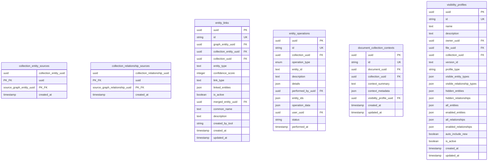

# Database Entity Relationship Diagram

This document provides a complete visual representation of the database schema, including all tables, fields, data types, and relationships.

## Database Overview

The database contains **27 tables** organized into 7 functional areas:

| Module | Tables |
|--------|--------|
| Core | `organizations`, `users` |
| Documents | `documents`, `document_versions` |
| Content Analysis | `summaries`, `topics`, `document_topics` |
| Graph | `graph_entities`, `graph_relationships` |
| Collections | `collections`, `file_collection_association`, `collection_entities`, `collection_relationships`, `collection_entity_sources`, `collection_relationship_sources`, `entity_links`, `entity_operations`, `document_collection_contexts`, `visibility_profiles` |
| Security | `roles`, `user_roles`, `role_permissions`, `audit_logs`, `rate_limits`, `security_policies` |
| Other | `tokens`, `feedback` |

---

## Complete Entity Relationship Diagram

This diagram shows all 27 tables and their relationships:

---

## Detailed Table Schemas

### Core Module

---

### Documents Module

---

### Content Analysis Module

---

### Graph Module

---

### Collections Module - Core Tables

---

### Collections Module - Junction and Supporting Tables

---

### Security Module

---

### Other Tables

---

## Key Relationships Summary

| Relationship | Cardinality | Description |
|-------------|-------------|-------------|
| organizations → users | 1:N | Multi-tenant user ownership |
| organizations → documents | 1:N | Multi-tenant document ownership |
| users → documents | 1:N | Document authorship |
| users → roles | M:N | Role-based access control via `user_roles` |
| documents → summaries | 1:N | AI-generated summaries |
| documents → document_versions | 1:N | Version history |
| documents ↔ topics | M:N | Topic categorization via `document_topics` |
| documents ↔ collections | M:N | Collection membership via `file_collection_association` |
| documents → graph_entities | 1:N | Entity extraction |
| graph_entities → graph_relationships | N:M | Graph edges (source/target) |
| collections → collection_entities | 1:N | Merged entity views |
| collection_entities ↔ graph_entities | M:N | Source tracking via `collection_entity_sources` |
| collections → collections | 1:N | Hierarchical collections (parent_uuid) |
| topics → topics | 1:N | Topic hierarchy (parent_topic_uuid) |

---

## Table Details by Module

### Core Module

#### organizations
Multi-tenant B2B organizations.
- **Constraints**: `name` cannot be empty
- **Unique**: `uuid`, `id`

#### users
Users with optional organization membership.
- **Constraints**: `username` not empty, valid email format
- **Unique**: `uuid`, `id`, `username`, `email`
- **Notes**: Supports both organizational and non-organizational users

### Documents Module

#### documents
Unified document/file storage with comprehensive metadata.
- **Constraints**: `title` not empty, valid `status`, `version` > 0, valid `processing_status`
- **Features**: Soft delete, version tracking, graph metadata, file storage info

#### document_versions
Historical versions for document version control.
- **Constraints**: `version` > 0

### Content Analysis Module

#### summaries
AI-generated document summaries.
- **Constraints**: `confidence_score` between 0-1, valid `status`

#### topics
Hierarchical topic taxonomy.
- **Constraints**: `global_importance` between 0-1, no self-reference
- **Unique**: `name`

#### document_topics
Junction table for document-topic relationships.
- **Constraints**: `relevance_score` between 0-1

### Graph Module

#### graph_entities
Entities extracted from documents for knowledge graph.
- **Source types**: file, collection_generated, document
- **Features**: Multi-source tracking, active/inactive state

#### graph_relationships
Edges connecting graph entities.
- **Constraints**: `confidence_score` between 0-1, `weight` > 0
- **Features**: Directed/undirected, multi-source tracking

### Collections Module

#### collections
Document groupings with graph generation capabilities.
- **Features**: Hierarchical (parent_uuid), soft delete, graph state management
- **Constraints**: `name` not empty

#### collection_entities
Merged entity views within a collection scope.
- **Features**: Lifecycle state management, merge tracking, concurrency control

#### collection_relationships
Merged relationship views within a collection.

#### entity_links
Cross-file entity linking for merge tracking.

#### entity_operations
Audit trail for entity management operations.
- **Operation types**: created, merged, split, deleted, updated, unmerged, link, unlink, initialize_graph, sync_graph

#### document_collection_contexts
Document-specific context within a collection.

#### visibility_profiles
Graph visualization configuration.
- **Profile types**: FILE, COLLECTION, GLOBAL

### Security Module

#### roles
Role definitions for RBAC.
- **Unique**: `name`

#### user_roles
User-role assignments.
- **Unique**: (`user_uuid`, `role_uuid`)

#### role_permissions
Fine-grained permission assignments.
- **Permission types**: READ, CREATE, UPDATE, DELETE

#### audit_logs
Unified audit logging for security compliance.

#### rate_limits
API rate limiting tracking.

#### security_policies
Configurable security policies.
- **Policy types**: ACCESS_CONTROL, DATA_PROTECTION, AUDIT, RATE_LIMIT

### Other

#### tokens
JWT token tracking with revocation support.
- **Primary Key**: JTI (JWT ID) as text

#### feedback
User feedback submissions.
- **Features**: Supports authenticated and anonymous feedback

---

## Dual ID Pattern

All models (except `Token` and junction tables) use the **Dual ID Pattern**:

| Field | Type | Purpose |
|-------|------|---------|
| `uuid` | UUID | Primary key for internal use and foreign key relationships |
| `id` | VARCHAR(8) | Short ID derived from UUID for UI display (last 8 chars of UUID hex) |

This pattern enables:
- Efficient UUID-based joins internally
- User-friendly short IDs for APIs and UIs
- Consistent referencing across the application

---

## Schema Management

The database schema is managed through SQLAlchemy models in `src/axai_pg/data/models/`.

**Model Files:**
- `base.py` - Base classes and DualIdMixin
- `organization.py` - Organization model
- `user.py` - User model
- `document.py` - Document and DocumentVersion models
- `summary.py` - Summary model
- `topic.py` - Topic and DocumentTopic models
- `graph.py` - GraphEntity and GraphRelationship models
- `collection.py` - All collection-related models
- `security.py` - Security and RBAC models
- `token.py` - JWT Token model
- `feedback.py` - Feedback model

Schema is created programmatically using `PostgreSQLSchemaBuilder` from `src/axai_pg/utils/schema_builder.py`.

See [`CLAUDE.md`](../../CLAUDE.md) for development workflow documentation.
