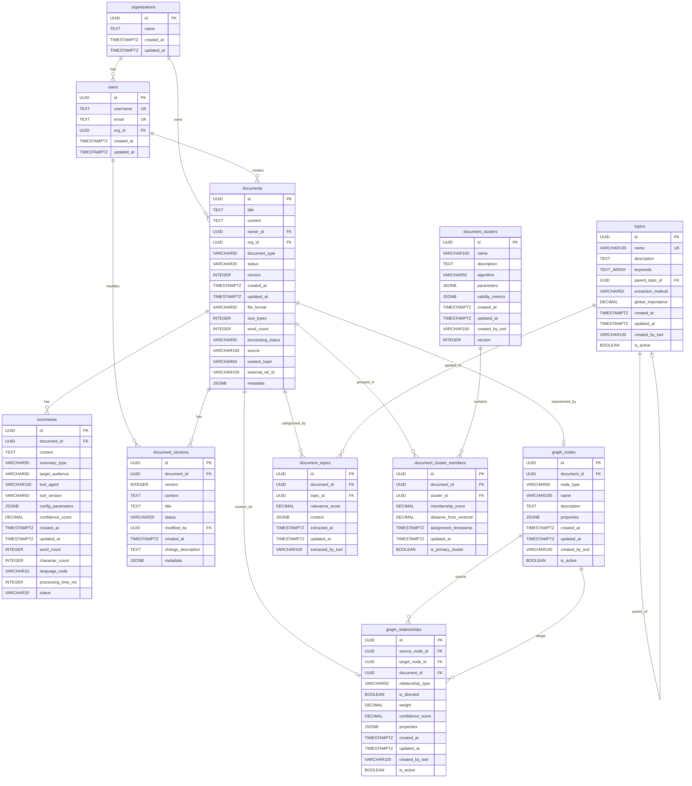
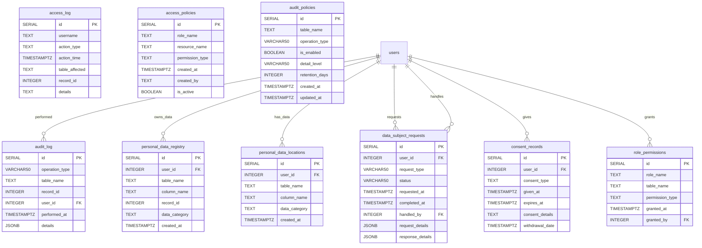

# Database Entity Relationship Diagram

This document provides a complete visual representation of the database schema, including all tables, fields, data types, and relationships.

## Database Overview

The database contains **20 tables** organized into 5 functional areas:

| Module | Tables |
|--------|--------|
| Core | organizations, users, documents |
| Content | summaries, document_versions |
| Graph | graph_nodes, graph_relationships |
| Topics/Clusters | topics, document_topics, document_clusters, document_cluster_members |
| Security/GDPR | audit_log, access_log, personal_data_registry, personal_data_locations, data_subject_requests, consent_records, role_permissions, access_policies, audit_policies |

---

## Core Entity Relationship Diagram

---

## Security and GDPR Tables

---

## Key Relationships Summary

| Relationship | Cardinality | Description |
|-------------|-------------|-------------|
| organizations → users | 1:N | Each organization has many users |
| organizations → documents | 1:N | Each organization owns many documents |
| users → documents | 1:N | Each user creates many documents |
| documents → summaries | 1:N | Each document can have multiple summaries |
| documents → document_versions | 1:N | Each document has version history |
| documents → graph_nodes | 1:N | Documents can be represented as graph nodes |
| documents → document_topics | M:N | Documents linked to topics via junction table |
| documents → document_cluster_members | M:N | Documents linked to clusters via junction table |
| graph_nodes → graph_relationships | N:M | Nodes connected by relationships (source/target) |
| topics → topics | 1:N | Self-referential hierarchy (parent_topic_id) |
| users → audit/security tables | 1:N | User actions tracked in security tables |

---

## Table Details by Module

### Core Module

#### organizations
Multi-tenant B2B organizations.
- **Constraints**: `name` cannot be empty

#### users  
Users belonging to organizations.
- **Constraints**: `username` not empty, valid email format
- **Unique**: `username`, `email`

#### documents
Core document storage with ownership and metadata.
- **Constraints**: `title` not empty, valid `status` (draft/published/archived/deleted), `version` > 0, valid `processing_status`

### Content Module

#### summaries
Document summaries generated by various tools/agents.
- **Constraints**: `content` not empty, `confidence_score` between 0-1, valid `status`

#### document_versions
Historical versions of documents for version control.
- **Constraints**: `title` not empty, valid `status`, `version` > 0
- **Unique**: `(document_id, version)`

### Graph Module

#### graph_nodes
Nodes for graph representation of document connections.
- **Node types**: document, concept, entity, topic, user, custom
- **Constraints**: `name` not empty

#### graph_relationships
Relationships between nodes in the document graph structure.
- **Relationship types**: references, contains, related_to, similar_to, contradicts, supports, custom
- **Constraints**: `confidence_score` between 0-1, `weight` > 0

### Topics/Clusters Module

#### topics
Topics extracted from document content for categorization.
- **Constraints**: `name` not empty, `global_importance` between 0-1, no self-reference
- **Unique**: `name`

#### document_topics
Junction table connecting documents to topics with relevance scores.
- **Constraints**: `relevance_score` between 0-1
- **Unique**: `(document_id, topic_id)`

#### document_clusters
Clusters of related documents generated by clustering algorithms.
- **Constraints**: `name` not empty, `algorithm` not empty, `version` > 0

#### document_cluster_members
Junction table connecting documents to clusters with membership scores.
- **Constraints**: `membership_score` between 0-1, `distance_from_centroid` >= 0
- **Unique**: `(document_id, cluster_id)`

### Security/GDPR Module

#### audit_log
Tracks database operations (INSERT, UPDATE, DELETE, SELECT).

#### access_log
Basic audit table for tracking access.

#### personal_data_registry / personal_data_locations
GDPR personal data tracking tables.
- **Data categories**: contact, identity, personal

#### data_subject_requests
GDPR data subject requests (erasure, export, access).

#### consent_records
GDPR consent tracking with expiration.

#### role_permissions / access_policies
Role-based access control configuration.

#### audit_policies
Audit policy configuration with retention settings.

---

## Schema Source Files

- Core schema: [`sql/schema/schema.sql`](../../sql/schema/schema.sql)
- Security schema: [`sql/security/security_schema.sql`](../../sql/security/security_schema.sql)
- Security setup: [`sql/security/security.sql`](../../sql/security/security.sql)
- GDPR: [`sql/gdpr/gdpr.sql`](../../sql/gdpr/gdpr.sql)

