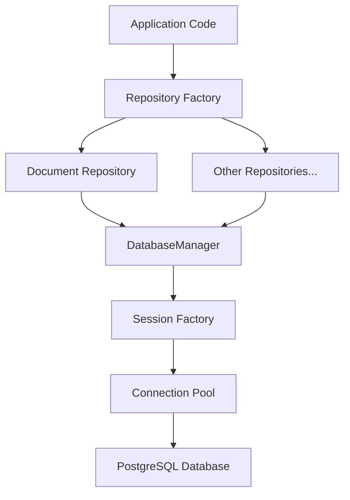

# PostgreSQL Data Access Layer Documentation

## Overview

This data access layer provides a robust interface for interacting with PostgreSQL in the document management system. It implements the repository pattern using SQLAlchemy 2.0, offering type-safe database operations, connection pooling, and comprehensive error handling.

## Architecture



## Key Components

### Core Classes

- **DatabaseManager**: Singleton manager for database connections and sessions
- **PostgresConnectionConfig**: Database connection configuration
- **PostgresPoolConfig**: Connection pool settings
- **AppSettings**: Environment-specific application settings

### Configuration

Environment-based configuration with three profiles:
- **Development**: Optimized for development with debug features
- **Test**: Minimal pool for testing
- **Production**: Optimized for stability and performance

### Health Monitoring

Built-in monitoring capabilities for:
- Connection pool statistics
- Query performance
- Error tracking
- Resource utilization

## Usage Examples

### Environment Configuration

```env
# Required environment variables
POSTGRES_HOST=your_host
POSTGRES_PORT=5432
POSTGRES_DB=your_database
POSTGRES_USER=your_username
POSTGRES_PASSWORD=your_password
APP_ENV=development|test|production

# Optional settings
DEBUG=false
LOG_SQL=false
DB_CONNECTION_TIMEOUT=30
```

### Basic Database Operations

```python
from axai_pg.data.config.settings import Settings
from axai_pg.data.config.database import DatabaseManager

# Initialize with environment settings
settings = Settings.load()
DatabaseManager.initialize(settings.conn_config, settings.env_config.pool_config)

# Get database manager instance
db = DatabaseManager.get_instance()

# Use session for database operations
with db.session_scope() as session:
    # All operations in this block are transactional
    from axai_pg.data.models import Document
    
    documents = session.query(Document).filter_by(status='published').all()
    
    # Automatic commit on success, rollback on exception
```

### Health Checks and Monitoring

```python
# Get database health status
health_status = db.check_health()
print(f"Status: {health_status['status']}")
print(f"Pool stats: {health_status['pool']}")

# Connection metrics available in health_status:
# - pool.size: Current pool size
# - pool.checkedin: Available connections
# - pool.overflow: Current overflow connections
# - pool.checkedout: Active connections
```

### Using the Repository Pattern

```python
from axai_pg.data.repositories import DocumentRepository

repo = DocumentRepository()

# Find documents by organization
docs = await repo.find_by_organization(org_uuid)

# Create document with summary
doc = await repo.create_with_summary(doc_data, summary_data)

# Update with version tracking
updated = await repo.update_with_version(doc_uuid, updates, "Updated content")
```

## Performance Considerations

### Connection Pooling

- Default pool size: 2-20 connections
- Suitable for dozens of concurrent users
- Configurable idle timeout: 30 seconds
- Connection acquisition timeout: 5 seconds

### Query Optimization

- Automatic query logging for operations exceeding 1 second
- Metrics tracking for monitoring performance
- Built-in connection pooling for efficient resource usage

### Caching

- Query result caching with configurable TTL
- Automatic cache invalidation on updates

## Security Features

### Query Safety

- Parameterized queries for SQL injection prevention
- Prepared statements for repeated operations
- Transaction support for data integrity

### Access Control

- Organization-level data isolation
- User ownership validation
- Role-based access control integration

## Error Handling

### Repository Layer

- Structured error handling with specific error types
- Transaction rollback on failures
- Detailed error logging
- Retry logic for transient failures

### Connection Management

- Automatic connection recovery
- Connection pool monitoring
- Health checks and diagnostics

## Monitoring and Metrics

### Available Metrics

- Operation counts
- Error rates
- Slow query detection
- Connection pool status
- Cache hit rates

### Usage Example

```python
from axai_pg.data.repositories import RepositoryFactory

factory = RepositoryFactory.get_instance()
metrics = factory.get_metrics(Document)

print(f"Total operations: {metrics.operation_count}")
print(f"Error count: {metrics.error_count}")
print(f"Slow queries: {metrics.slow_query_count}")
```

## Best Practices

1. **Connection Management**
   - Always use the DatabaseManager instead of creating direct connections
   - Use the session_scope() context manager for automatic cleanup
   - Monitor connection pool metrics

2. **Transaction Handling**
   - Use transactions for operations that modify multiple records
   - Keep transactions short and focused
   - Let the context manager handle commit/rollback

3. **Error Handling**
   - Always catch and handle database errors appropriately
   - Log errors with sufficient context
   - Use type-safe error handling

4. **Query Optimization**
   - Monitor slow queries
   - Use appropriate indexes
   - Limit result sets with pagination

## Implementation Notes

- The data access layer is designed for a B2B multi-tenant document management system
- Performance is optimized for standard web response times (< 1 second)
- The implementation supports low to moderate concurrent user loads
- The design focuses on maintainability and type safety
